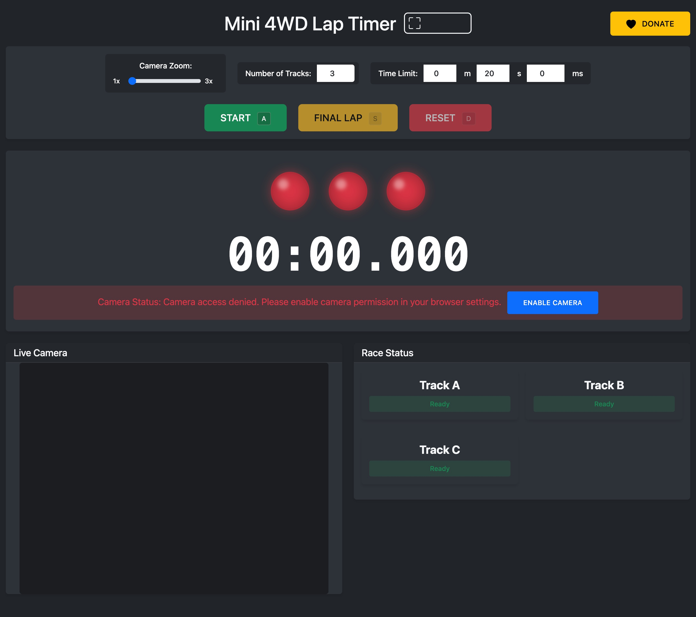

# Mini 4WD Lap Timer

A professional web-based lap timing system designed specifically for Mini 4WD racing. This application provides accurate timing, multi-track support, automatic car detection, and real-time results display.



## Features

- 🎥 Live camera feed with motion detection
- 🏁 Support for 2-5 track simultaneous timing
- ⚡ Real-time car detection and timing
- 🎯 Automatic winner detection
- 📸 Winner moment snapshot capture
- 🚦 Race start light system
- ⌨️ Keyboard shortcuts for quick control
- 📱 Responsive design works on all devices
- 🖥️ Fullscreen mode for race events

## Requirements

- Modern web browser with camera support
- Webcam or USB camera
- Proper lighting for reliable car detection
- Mini 4WD track with clear detection zones

## Setup

1. Clone or download this repository
2. Ensure all files are in the same directory:
   ```
   lap-timer/
   ├── index.html
   ├── script.js
   ├── styles.css
   ├── instruction.md
   ├── bootstrap/
   │   ├── css/
   │   │   └── bootstrap.min.css
   │   └── js/
   │       └── bootstrap.bundle.min.js
   └── favicon/
       └── [favicon files]
   ```
3. Open `index.html` in a modern web browser
4. Allow camera access when prompted
5. Position your camera to view all track lanes
6. Adjust zoom level if needed
7. Set number of tracks and time limit
8. Ready to race!

## Usage

### Basic Race Flow

1. Set up tracks and camera position
2. Configure track count and time limit
3. Press Start (or 'A' key)
4. First car detection starts the timer
5. Press Final Lap (or 'S' key) for last lap
6. Results display automatically
7. Press Reset (or 'D' key) for new race

### Controls

#### Input Settings
- **Camera Zoom**: 1x-3x adjustment
- **Track Count**: 2-5 tracks
- **Time Limit**: MM:SS.mmm format

#### Race Controls
- **Start** (A key): Begin race
- **Final Lap** (S key): Mark final lap
- **Reset** (D key): Clear and restart

For detailed instructions, see [instruction.md](instruction.md)

## Camera Setup Tips

1. **Position**
   - Mount camera above track
   - Ensure all lanes visible
   - Avoid shadows and reflections

2. **Lighting**
   - Use consistent lighting
   - Avoid direct glare
   - Ensure detection zone is well-lit

3. **Detection Zone**
   - Keep background simple
   - Mark clear finish line
   - Test detection before racing

## Troubleshooting

1. **No Camera Access**
   - Check browser permissions
   - Ensure camera is connected
   - Try refreshing page

2. **Poor Detection**
   - Adjust lighting
   - Check camera position
   - Adjust zoom level
   - Ensure clear view of all lanes

3. **Browser Issues**
   - Use latest Chrome/Firefox/Edge
   - Enable hardware acceleration
   - Clear browser cache

## Support

If you find this tool useful, consider supporting its development:

- 💝 Support via [Saweria](https://saweria.co/gimdash)
- ⭐ Star this repository
- 🐛 Report issues
- 💡 Suggest features

## License

This project is licensed under the MIT License - see the [LICENSE](LICENSE) file for details.

## Acknowledgments

- Built with Bootstrap for responsive design
- Uses HTML5 Canvas for motion detection
- Community feedback and testing

## Contributing

1. Fork the repository
2. Create your feature branch
3. Commit your changes
4. Push to the branch
5. Create a new Pull Request

## Version History

- v1.0.0 - Initial release
  - Basic timing functionality
  - Multi-track support
  - Motion detection

- v1.1.0 - Enhanced features
  - Winner snapshot
  - Start lights
  - Keyboard shortcuts
  - Fullscreen mode 